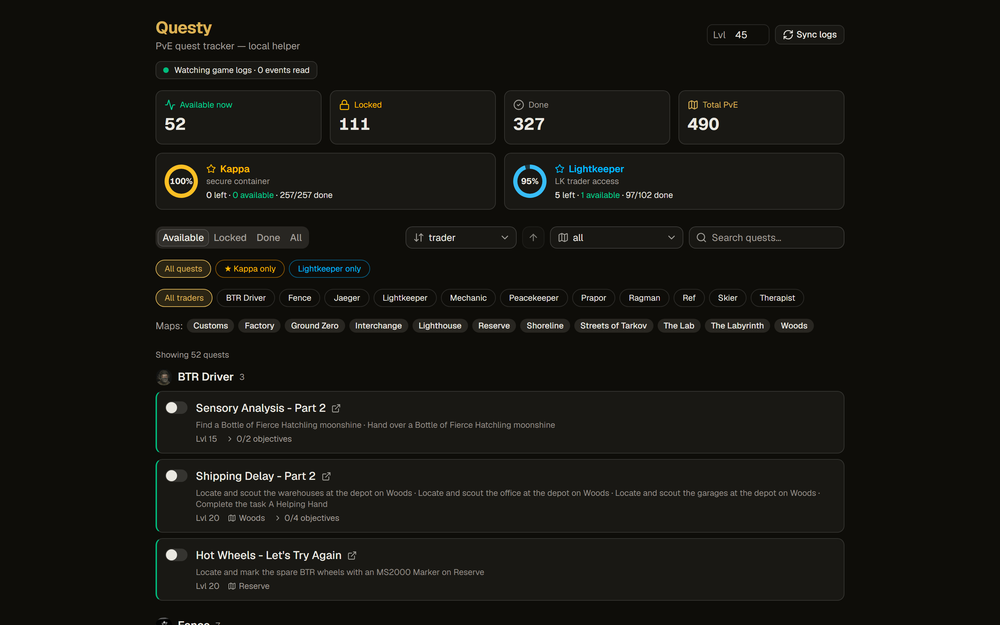
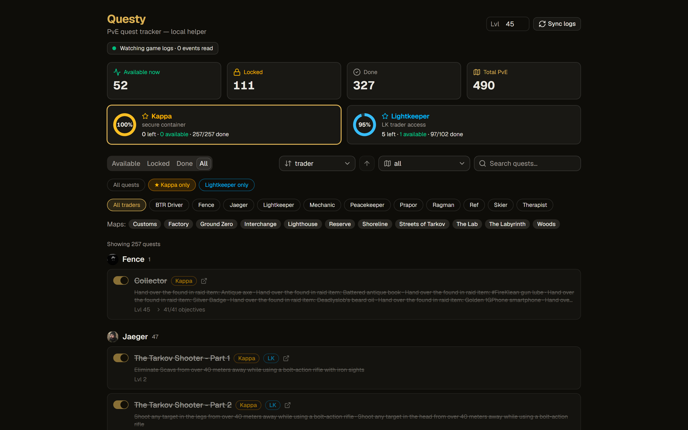
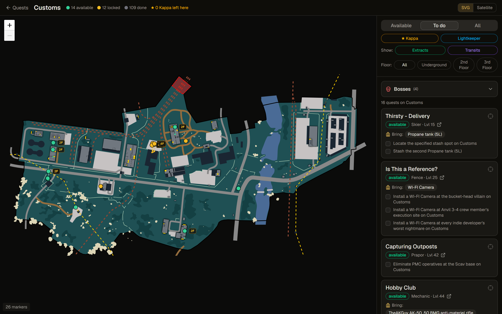
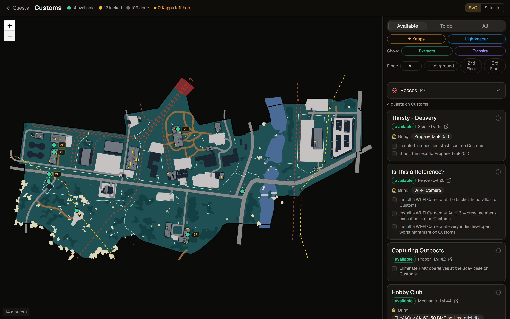

# 🎯 Questy

### A local quest & map tracker for **Escape from Tarkov** (PvE)

Stop alt-tabbing to a wiki. Questy reads your game's own logs to track your quest progress
**automatically**, and shows you what to do next — and exactly **where** to do it.

&nbsp;·&nbsp; 100% local &nbsp;·&nbsp; auto-updating &nbsp;·&nbsp; no login

---

## ⬇️ Install (Windows)

1. **[Download the latest release](https://github.com/BadCodesGG/Questy/releases/latest)** → grab `Questy_<version>_x64-setup.exe`
2. Run it and launch **Questy**.
3. That's it. When a new version ships, the app tells you and updates itself in one click.

> **First run:** Questy auto-detects your Tarkov install. If it can't, use **File → Set Tarkov Logs
> Folder…** and pick your `…\Battlestate Games\EFT\Logs` folder. Your progress is stored privately
> on your PC (`%APPDATA%\gg.badcodes.questy`).

---

## 🔒 Completely local — and ToS-safe

Questy runs entirely on your machine. **Nothing about your account is ever sent anywhere.** It only
*reads* the log files the game already writes to your disk — there's **no memory reading, no network
interception, no injection, nothing ToS-risky**. Quest and map data comes from the community
[tarkov.dev](https://tarkov.dev) API.

---

## ✨ What you can do

### 📋 Track every quest, automatically
Finish a quest in-game and Questy flips it to **Done** within ~20 seconds — no checklists to
maintain. See what's **available now**, what's **locked** (and exactly what's blocking it), and your
**Kappa** & **Lightkeeper** progress at a glance. Filter by trader, map, or questline; search; sort;
or toggle anything by hand.

### 🗺️ Know *where* to go
Open any map and see your quest objectives as markers, **colored by status**. A side panel lists
every quest on that map — what to **bring into raid**, which items must be **Found-in-Raid**, and
multi-select to highlight just the markers you care about. Full **floor** support, plus **extract**
and **transit** overlays.

### 🎯 Focus on what matters
Select the quests you're running this raid and isolate their markers — no clutter from the other 100
objectives on the map.

---

## 🚀 Features at a glance

| | |
|---|---|
| **Automatic progress** | Reads `*output_000.log` to mark quests Started / Done / Failed — live, within ~20s |
| **Quest dashboard** | Group by trader, filter by status / map / questline, search, sort, manual toggle |
| **Interactive maps** | Objective markers by status, per-floor isolation, extracts & transits, SVG/satellite layers |
| **Kappa & Lightkeeper** | Dedicated questline progress (done / available / remaining) |
| **Bring-into-raid** | Per-quest item checklist, with Found-in-Raid flagged |
| **Shareable views** | Every filter & selection lives in the URL — bookmark and share |
| **Auto-updates** | Signature-verified updates, prompted on launch |
| **Private by design** | Local-only; your data never leaves your PC |

---

## 🔄 How progress tracking works

Your live EFT profile lives on Battlestate's servers, so there's no local save file to read. Instead
the game writes a Unity player log that records a `Session mode: Pve` line and every time a trader
marks a quest **Started / Finished / Failed**. Questy replays your existing logs on startup to
backfill, then tails the live log as you play. Anything the logs can't cover (quests finished before
your earliest log) you can mark by hand — manual edits always win.

---

## ❓ FAQ

**Is this against the rules / will it get me banned?**
No. Questy never touches the game process or your account — it only reads log files Tarkov already
writes locally, the same approach as [TarkovMonitor](https://github.com/the-hideout/TarkovMonitor).

**Does it work for live/PvP?**
Questy is built for **PvE** progress (it filters to `Session mode: Pve`).

**Where's my data stored?**
Locally, in `%APPDATA%\gg.badcodes.questy`. Nothing is uploaded.

**It didn't find my logs.**
Use **File → Set Tarkov Logs Folder…** and point it at `…\Battlestate Games\EFT\Logs`.

---

**[⬇️ Download the latest release](https://github.com/BadCodesGG/Questy/releases/latest)**

Questy is an unofficial, fan-made tool and is not affiliated with Battlestate Games. 
Quest & map data courtesy of [tarkov.dev](https://tarkov.dev) and [the-hideout](https://github.com/the-hideout).

